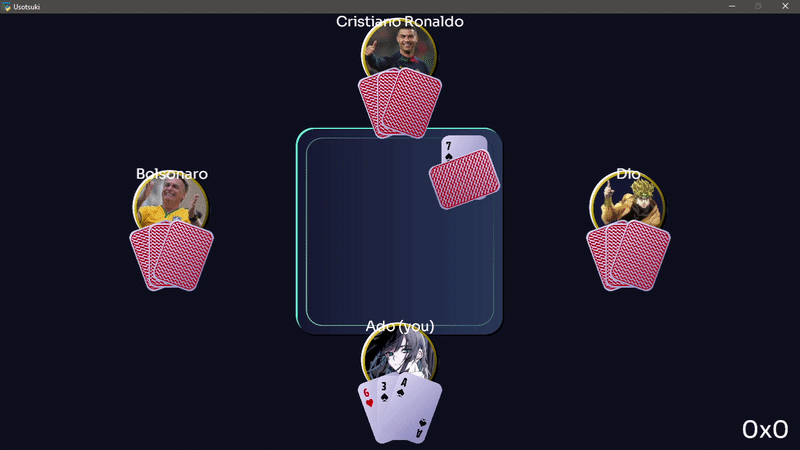

# USOTSUKI

A graphical Brazilian Truco game made with **Python** and **Arcade**.



Play a match against three bots, call Truco, raise the stakes, fold, and fight your way to 12 points.

Developed as my final project for CS50x.

## v0.1.0 Features

- Brazilian Truco gameplay
- 4-player matches: 1 human player + 3 bots
- Card dealing and shuffling
- "Vira" and "Manilha" system
- Trick resolution
- Tie handling
- Round and match scoring
- Stake increases: Truco, Six, Nine and Twelve -> Accept, Raise or Fold
- Graphical interface built with Arcade
- Sprites made in Inkscape
- Fullscreen support

## Controls

- |MOUSE CLICK| - Play a card
- |R| - Call TRUCO or raise
- |A| - Accept truco
- |F| - Fold
- |F11| - Toggle fullscreen
- |ESC| - Exit fullscreen

## Gameplay

Usotsuki is designed to keep the rules of Brazilian Truco while presenting them through a simple graphical interface. The player controls one of the four seats at the table, while the other three seats are controlled by bots. Each round consists of several tricks, with the objective of winning two of them before the opposing team.

The game also includes the betting system that makes Truco different from a simple card game. Players can increase the value of a round by calling Truco, Six, Nine or Twelve. Each increase creates a decision for the opposing team: accept the new value, raise it further, or fold and give the round to the other team.

The bots use the same game rules as the human player and interact with the game through the same action system. This means that the graphical interface does not need to know whether an action came from a human player or a bot.

## Installation

Run the following in your terminal to clone the repository:

```bash
git clone <repository-url>
cd usotsuki
```

Install the requirements with:

```bash
pip install -r requirements.txt
```

## Built With

- Python
- Arcade
- Inkscape
- Python generators
- Object-oriented programming
- Dataclasses
- Type hints

## Technical Overview

The game logic is separated from the graphical interface: The core game uses a generator-based architecture to control
the flow of the match. The *step()* generator yields the player who must act, while the graphical interface sends the
player's action back into the game through *send()*. This allows game logic to remain independent from Arcade's event loop.

The main components include:

- **Game**: Controls the match, rounds, scoring and Truco logic.
- **Player**: Represents the human player and serves as base class for Bot.
- **Bot**: Extends from Player, makes independent choices for computer-controlled players.
- **Card**: Frozen dataclass that represents a single card in the deck.
- **Deck**: Generates and contains all 40 cards, controls shuffling and dealing. 
- **UsoWindow**: Extends from *arcade.Window*, renders the game and sends user input to the Game
- **PlayerView, CardView, TableView and ScoreView**: Handle visual representation for the game's entities.


## Project Structure

``` text
usotsuki/ {
    uso.py - game launcher
    README.md <- You are here!
    requirements.txt

    usotsuki/{
        core/ - Contains the game's fundamental pieces{
            core.py
            enums.py
            game.py
        }

        toolbox/ - Contains TimeCounter, used for debugging{
            time_functions.py
        }

        ui/ - Contains everything relevant for visual representation {
            fonts/ {
                OFL.txt
                *All Sora font weights*
            }

            sprites/png/cards/ - Contains every card sprite {}

            view.py
            window.py
        }
    }
}
```

## Design Decisions

A significant design choice was using a generator instead of a traditional loop to control the match. A conventional game loop could have handled turns, but it would have made the game's decision flow more tightly coupled to the graphical framework. Using a generator, I was able to make the Game module deliver turns one at a time, waiting for the Player (or Bot) to send input in order to unpause the main logic.

Another decision was representing cards using frozen dataclasses. Since a card's identity throughout the match remains always the same, I made the class immutable to prevent accidental modification while keeping the representation concise.

The game also uses separate view classes instead of drawing every element directly inside the *UsoWindow*. This keeps the main window responsible primarily for input and coordination, while PlayerView, CardView and others handle their respective visual elements.

## Future Improvements

Possible future improvements include adding more sophisticated bot behavior, improving the visual feedback during gameplay, adding sound effects and music, and expanding the interface with additional game information.

The current version focuses primarily on implementing the core rules and creating a complete playable match. These improvements could be added without fundamentally changing the game's core architecture.

## CS50x

Usotsuki was created as my final project for **Harvard University's CS50x.**

The project was designed to apply concepts learned throughout the course, while also allowing me to learn and explore
Python generators (which were, arguably, the hardest feature to implement), object-oriented programming, game-state management and graphical programming with Arcade.

## Author

### Eduardo Lopes Stocco - "Ezu"


Built with Python, Arcade and Inkscape. 
